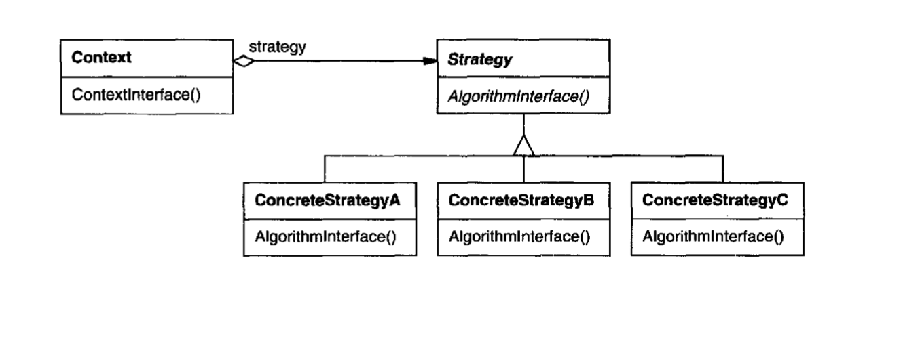

## Strategy
- Intent: Create an interchangeable group of algorithms.
- Strategy lets you group together similar algorithms, or different implementations of the same algorithm.

## General Structure

## Example
In my example the participants are represented as following:
- Context: [CasifyContext](./CasifyContext.java)
- Strategy Interface: [CaseStrategy](./strategies/CaseStrategy.java)
- Concrete Strategies: [CamelCaseStrategy](./strategies/CamelCaseStrategy.java),
[PascalCaseStrategy](./strategies/PascalCaseStrategy.java),
[SentenceCaseStrategy](./strategies/SentenceCaseStrategy.java),
[SnakeCaseStrategy](./strategies/SnakeCaseStrategy.java)

## Pros/Cons
Pros ❤️
- You can choose the algorithm used at runtime.
- Implementation details of the algorithm are isolated from the code that uses it.
- New strategies can be added without changing the context.

Cons 💔
- Complicated, a lot of extra classes, not useful for small number of algorithms that rarely change.
- Client needs to know what strategy to select.
- Obsolete in modern languages, replaced by anonymous functions.