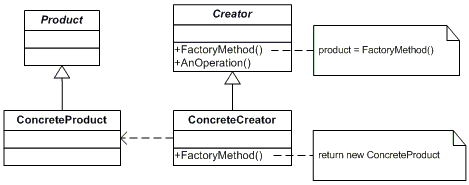

## Factory Method
- Intent: Define an interface for creating an object, but let subclasses decide which class to instantiate. Factory Method lets a class defer instantiation to subclasses.
- Also known as "Virtual Constructor".
- Use the Factory Method pattern when:
    - a class can't anticipate the class of objects it must create.
    - a class wants its subclasses to specify the objects it creates.
    - classes delegate responsibility to one of several helper subclasses, and you want to localize the knowledge of which helper subclass is the delegate.

## General Structure

## Example
Participants in the example code:
- Product: [Animal](./animals/Animal.java)
- ConcreteProduct: [Dog](./animals/Dog.java), [Cat](./animals/Cat.java)
- Creator: [AnimalShelter](./factory/AnimalShelter.java)
- ConcreteCreator: [DogShelter](./factory/DogShelter.java), [CatShelter](./factory/CatShelter.java)

## Pros/Cons
Pros ❤️
- Single Responsibility Principle - Product creation code is in the factory, the rest of the application doesn't need to worry about it.
- Open/Closed Principle - Allows introducing new types of products into the application without breaking existing client code.

Cons 💔
- Clients might have to subclass the Creator class just to create a particular ConcreteProduct object. Subclassing is fine when the client has to subclass the Creator class anyway, but otherwise the client now must deal with another point of evolution.